# 🚩 Audit Report: "Active" (Hack The Box)

| Name | IP | Difficulty | OS |
| :--- | :--- | :--- | :--- |
| **Active** | 10.129.3.175 | Facile | Windows |

## 1. Executive Summary
The objective of this audit was to evaluate the security of a Windows Domain Controller. The assessment revealed two critical configuration flaws: unprotected sensitive files in SMB shares and a vulnerable service account. These flaws allowed for a full domain compromise (Domain Admin).

## 2. Reconnaissance & Enumeration (Nmap)
We start by running an Nmap scan on the target to discover active services.

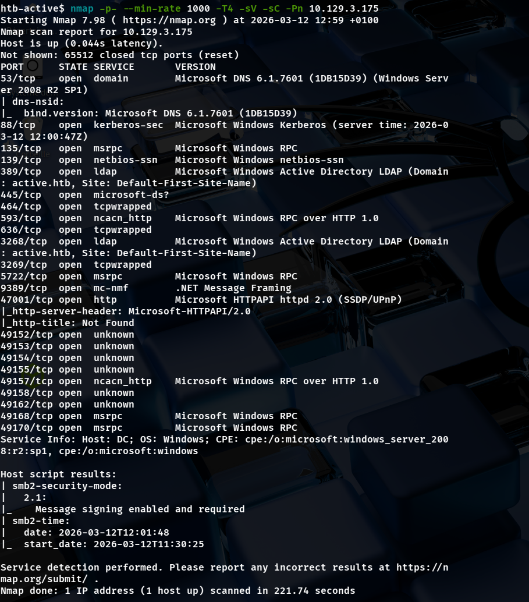

Nmap shows that the target is an Active Directory domain controller for active.htb. The DNS version (6.1) confirms that the operating system is Windows Server 2008 R2 SP1. I added this domain to my /etc/hosts file to help my tools communicate correctly with the target during the next steps.

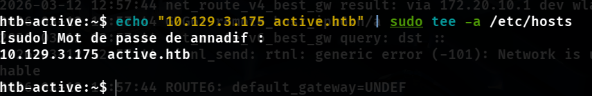

## 3. SMB Enumeration
Since port 445 was open, I checked for anonymous access to the SMB shares. 
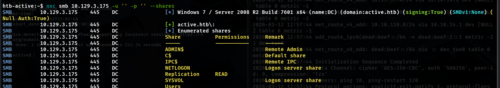

Using NetExec (formerly CrackMapExec), I discovered that the Replication share was readable without any credentials.

Let's connect to the Replication share 
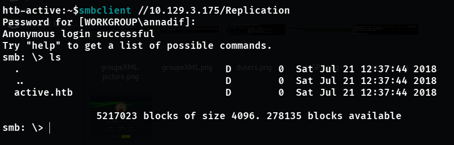

The Replication share usually contains Group Policy Objects (GPOs). I searched through the directories and found a file named Groups.xml.

This file is a "gold mine" because it contains a cpassword — an encrypted password for the SVC_TGS user.

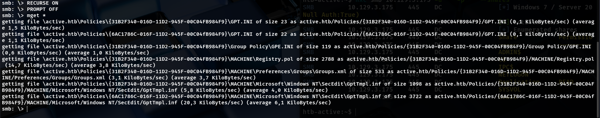

Microsoft used to store passwords this way, and although they are encrypted, the AES key is public knowledge. I used the gpp-decrypt tool to recover the password in cleartext.

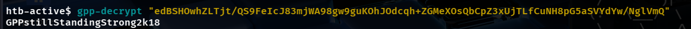

## 4. Foothold
The user flag can be retrieved by connecting to the Users share, and navigating to SVC_TGS 's Desktop.
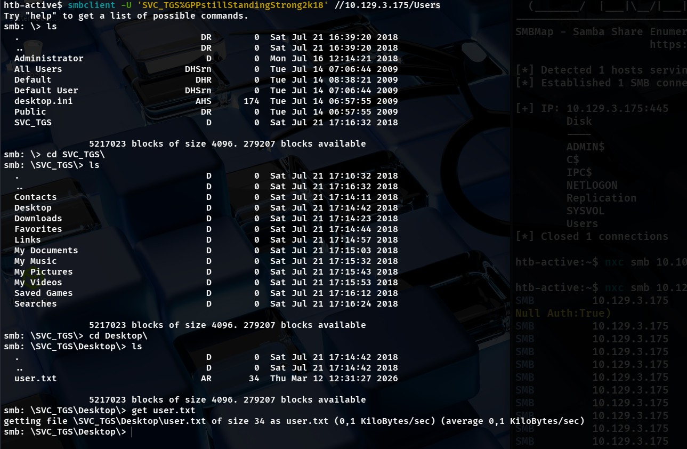

## 5. Privilege Escalation
After gaining initial access as SVC_TGS, I started looking for a way to become a Domain Administrator. I first used the GetADUsers.py tool to list the users in the Active Directory.
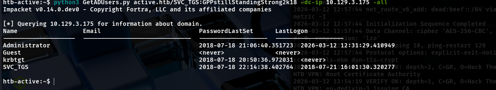

Kerberoasting Attack
I discovered that the Administrator account was linked to a Service Principal Name (SPN). This made it vulnerable to a Kerberoasting attack.

Impacket’s GetUserSPNs.py lets us request the TGS and extract the hash for offline cracking.
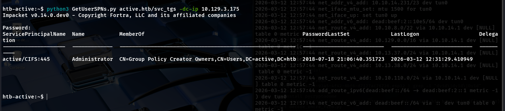

We can use hashcat with the rockyou.txt wordlist to crack the hash and obtain the password
Ticketmaster1968 for the user active\administrator.
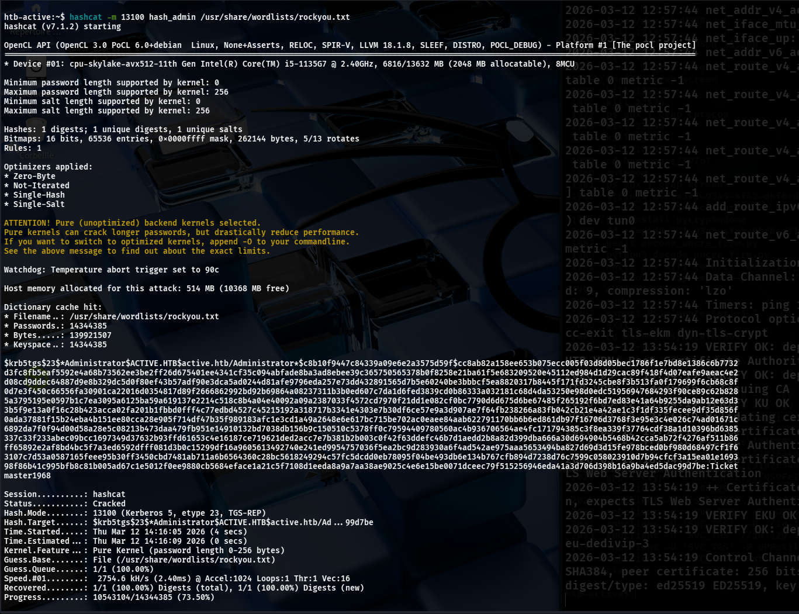

## 6. Post-Exploitation & Proof of Concept

To finalize the audit and confirm full control over the domain controller, I used the Administrator credentials with wmiexec.py from the Impacket suite.

This tool provides an interactive shell using the Windows Management Instrumentation (WMI) protocol. It is a "fileless" method, meaning it executes commands without leaving heavy traces on the target's disk.

With this access, I successfully retrieved the final flags and validated the total compromise of the Active Directory domain.

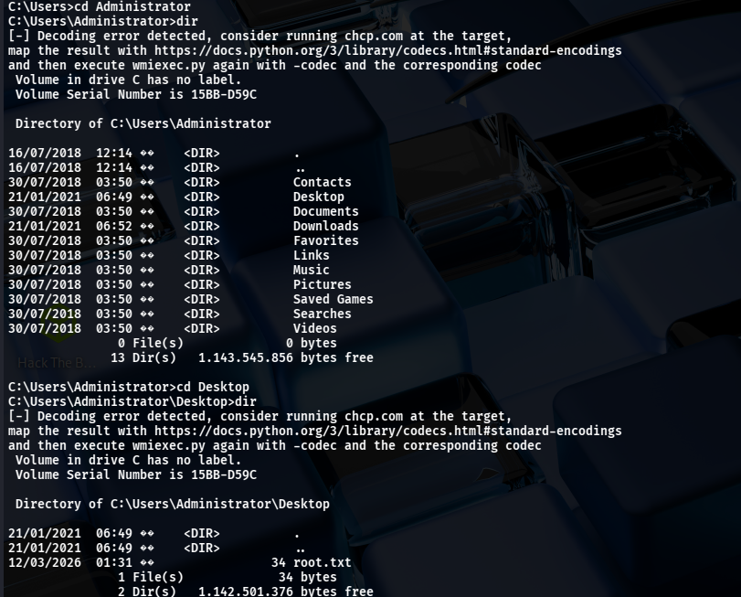

The final flag can be found at C:\Users\Administrator\Desktop\root.txt .

## Recommended Removals & Security Best Practices

To secure the environment and prevent similar attacks in the future, I recommend the following actions:
1. Fix the GPP Vulnerability (Initial Access)

    Apply Patch MS14-025: This update prevents Windows from storing passwords in the Group Policy Preference (GPP) XML files.

    Clean up SYSVOL: Administrators should manually search for and delete any existing Groups.xml files that contain the cpassword attribute in the SYSVOL share.

2. Mitigate Kerberoasting (Privilege Escalation)

    Password Complexity: Enforce a strong password policy for service accounts. Passwords should be long (over 25 characters) and complex to make offline cracking impossible.

3. General Hardening

    Disable Guest/Anonymous Access: Restrict SMB share permissions to ensure that sensitive folders like Replication cannot be read without proper authentication.
