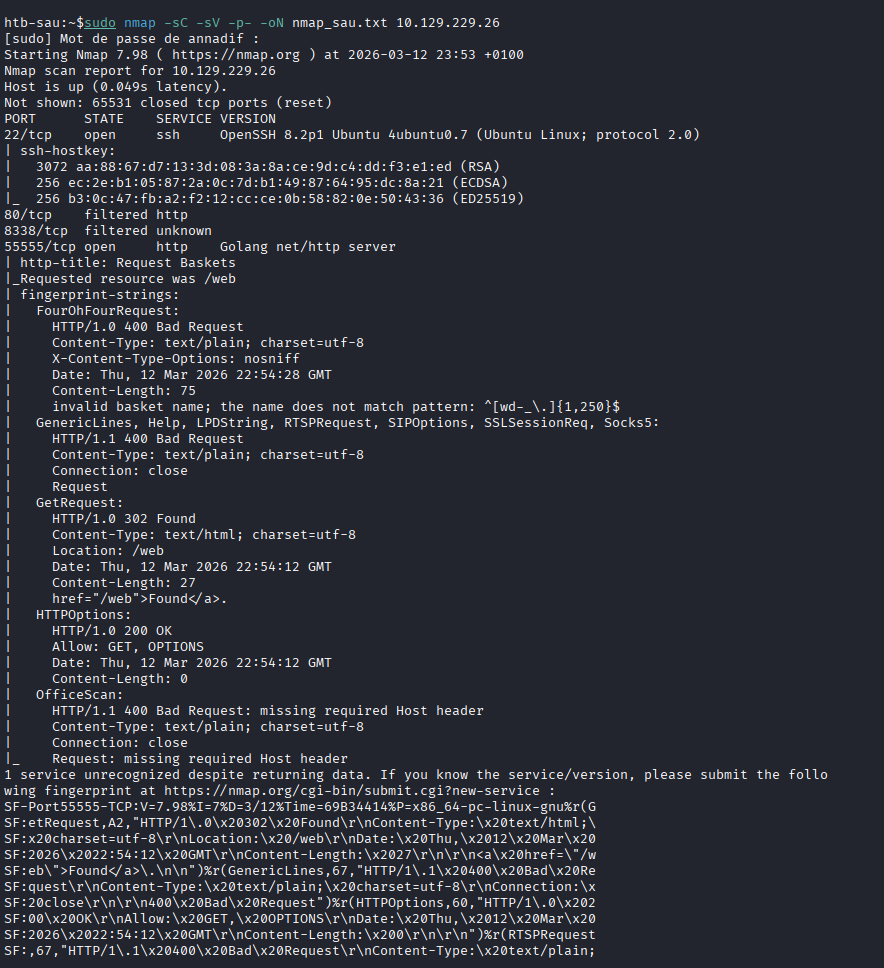
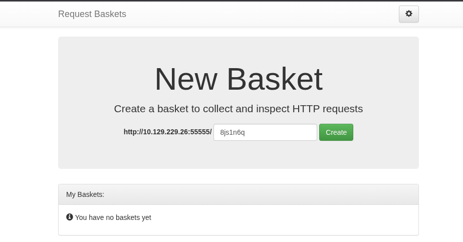
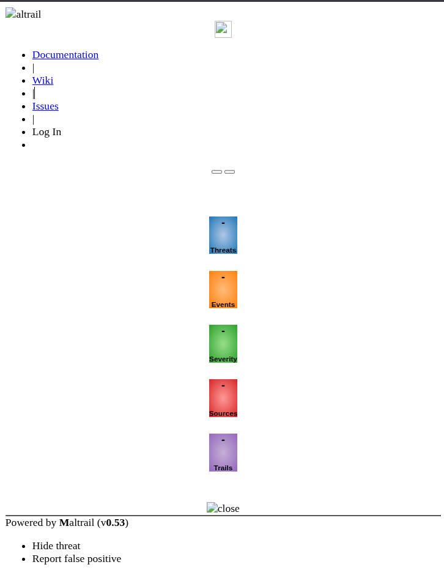
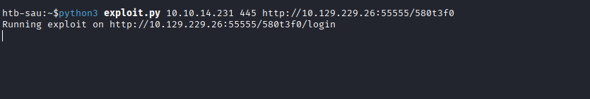
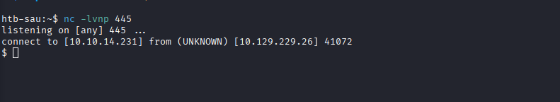
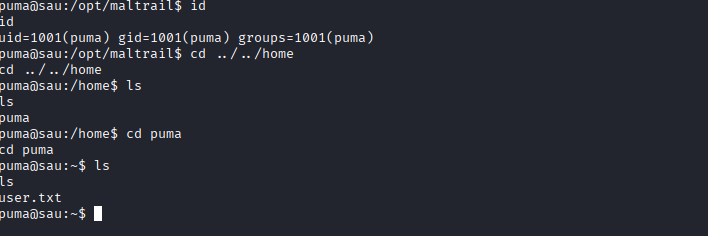
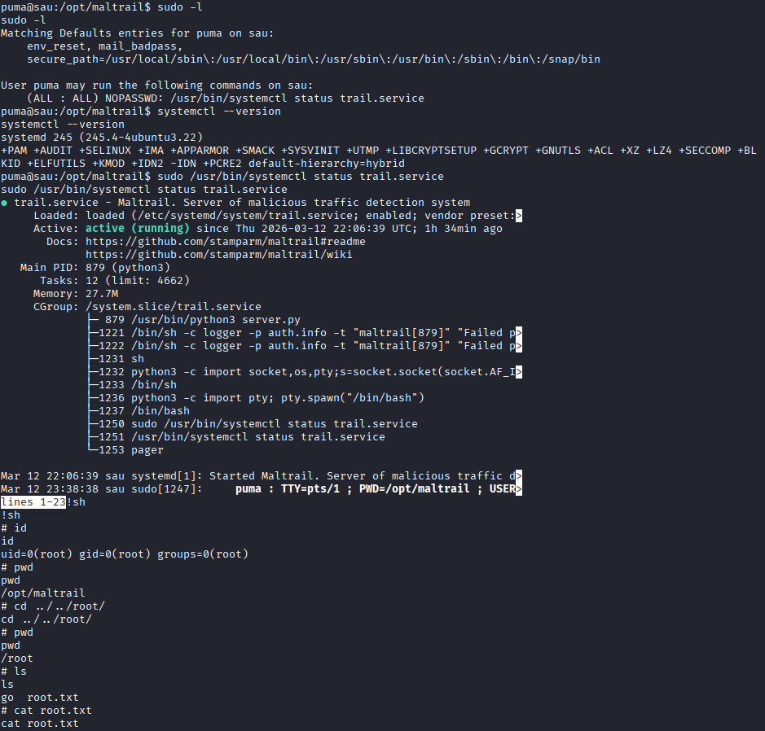

# 🚩 Audit Report: "Sau" (Hack The Box)

| Name | IP | Difficulty | OS |
| :--- | :--- | :--- | :--- |
| **Sau** | 10.129.229.26 | Easy | Linux (Ubuntu) |

## 1. Executive Summary
The audit of the "Sau" machine revealed a sophisticated attack chain involving web service vulnerabilities and system misconfigurations. By exploiting a **Server-Side Request Forgery (SSRF)**, I bypassed firewall restrictions to access an internal monitoring tool. A subsequent **Remote Code Execution (RCE)** provided initial access as a low-privilege user, which was eventually elevated to **Root** privileges by exploiting a misconfigured `sudo` permission on a system utility.

## 2. Reconnaissance & Enumeration (Nmap)
Initial reconnaissance began with a comprehensive Nmap scan to identify active services and the target's attack surface.

**Analysis:**
* **Port 22/TCP**: OpenSSH 8.2p1.
* **Port 55555/TCP**: Hosting **Request Baskets**, a tool to inspect HTTP requests.
* **Ports 80 & 8338**: Marked as **Filtered**, suggesting they are protected by a firewall and only accessible internally.

## 3. Initial Access: SSRF (Request Baskets)
The **Request Baskets** service (v1.2.1) was found to be vulnerable to **SSRF** (CVE-2023-27163). This allowed me to force the server to make requests to its own internal ports.

By creating a new "basket" and configuring it to forward requests to `http://127.0.0.1:80/` with the **Proxy Response** setting enabled, I successfully reached an internal instance of **Maltrail (v0.53)**.

## 4. Foothold: Maltrail RCE
**Maltrail v0.53** is vulnerable to an **OS Command Injection** via the `username` parameter on the login page. I utilized an [exploit script](./exploit.py) to inject a reverse shell payload through this parameter.

I captured the incoming connection on my local machine using `nc`, obtaining an initial shell as the user **puma**. I then stabilized the shell to gain a fully interactive terminal.

**User Flag:**

## 5. Privilege Escalation: Sudo & Systemctl
While checking sudo privileges with `sudo -l`, I discovered that the user **puma** could execute `/usr/bin/systemctl status trail.service` as **root** without a password.

**Exploitation Process:**
1. Running the command triggered the **pager** (less) because the output was longer than the terminal height.
2. By typing `!sh` within the pager interface, I successfully escaped to a shell with **root** privileges.
3. Full system compromise was confirmed by retrieving the root flag.

## 6. Post-Exploitation
Confirmation of the solve on the Hack The Box platform.

## 🛡️ Recommended Remediations
1. **Service Updates**: Update **Request Baskets** to a version > 1.2.1 and **Maltrail** to the latest version to patch SSRF and RCE vulnerabilities.
2. **Sudo Hardening**: Remove the `NOPASSWD` entry for `systemctl`. If access is necessary, ensure the pager is disabled (e.g., by using the `--no-pager` flag) to prevent shell escapes.
3. **Network Security**: Review internal firewall rules to ensure that sensitive services on `127.0.0.1` are not exposed through application-level proxies.

---
